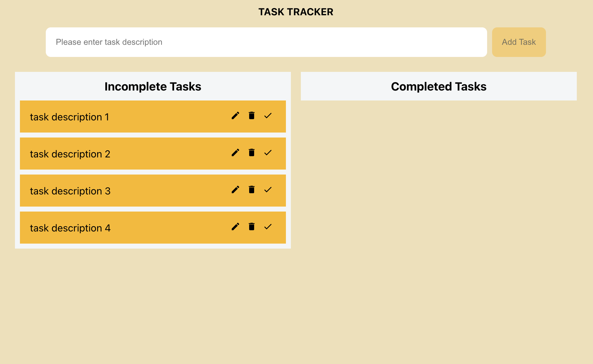
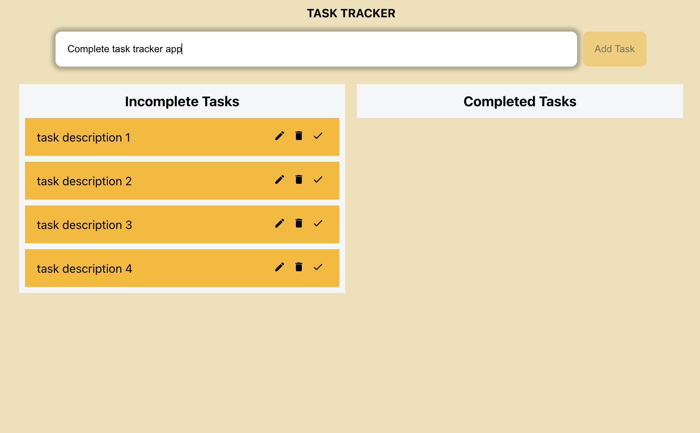
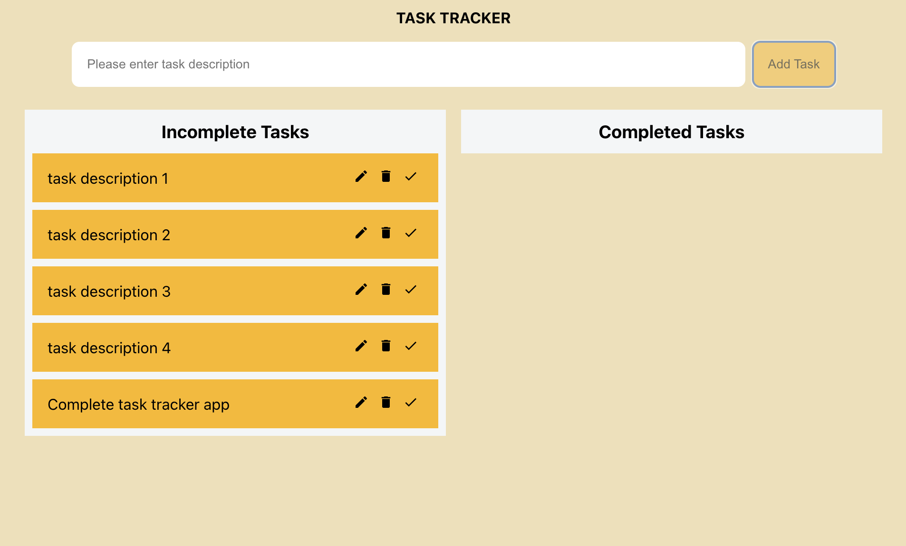
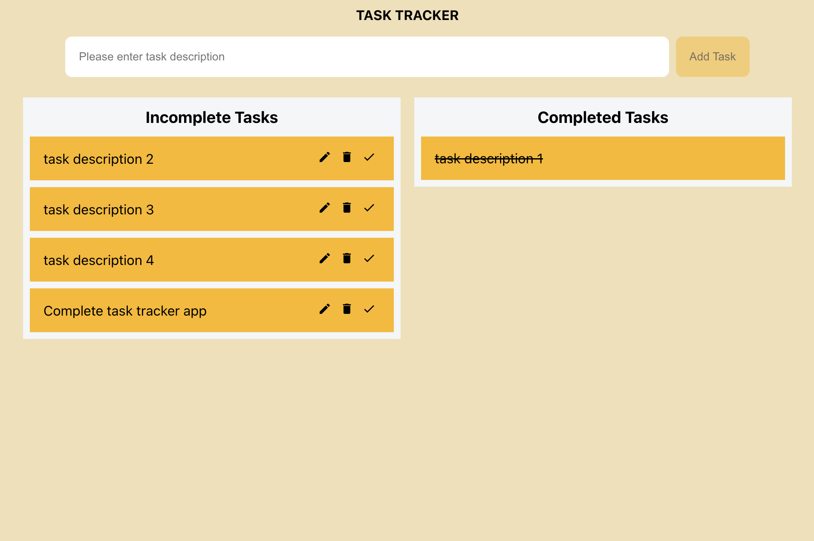
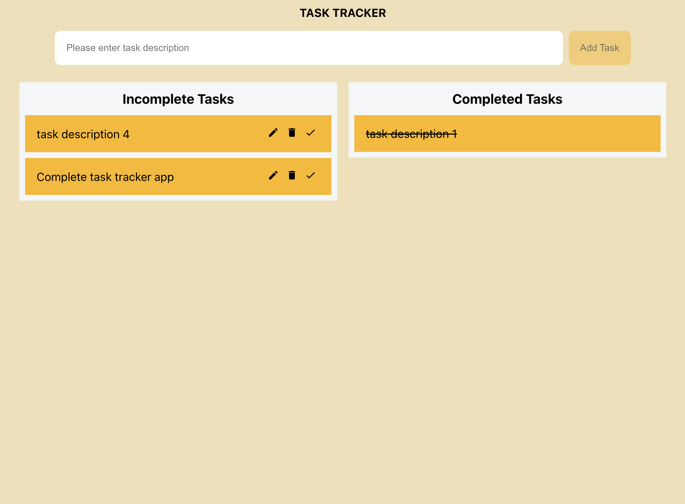
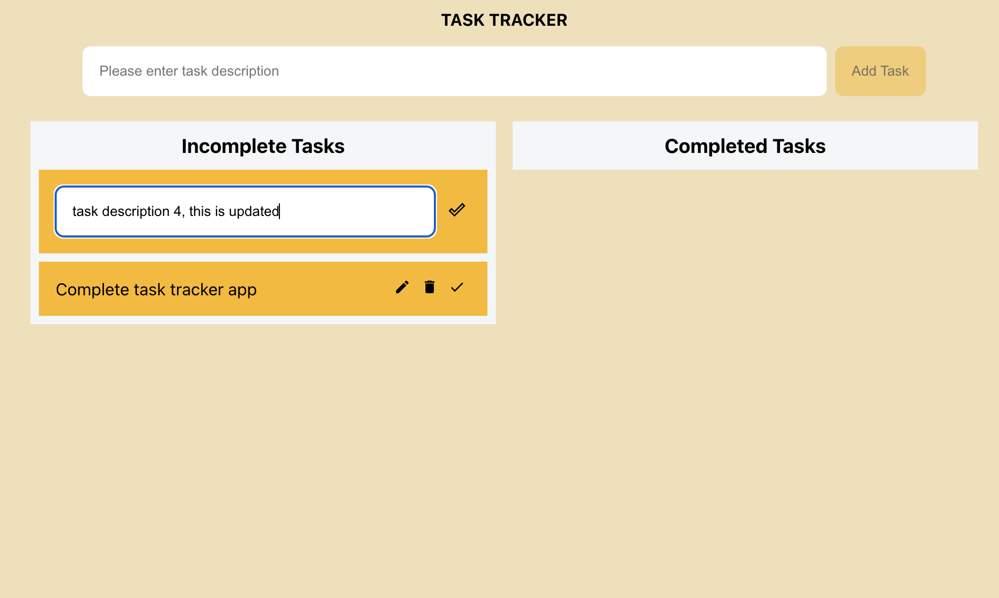
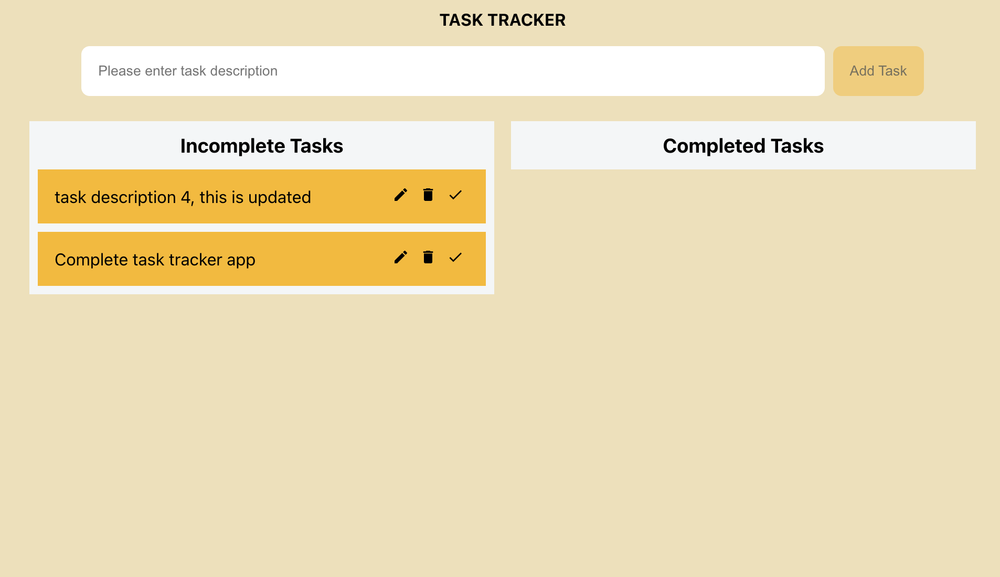

# Task Tracker

Simple task tracker application which allows you to keep track of tasks. Developed using ReactJS and Redux toolkit. Supports adding a task, deleting a task, updating a task, marking a task as complete.

